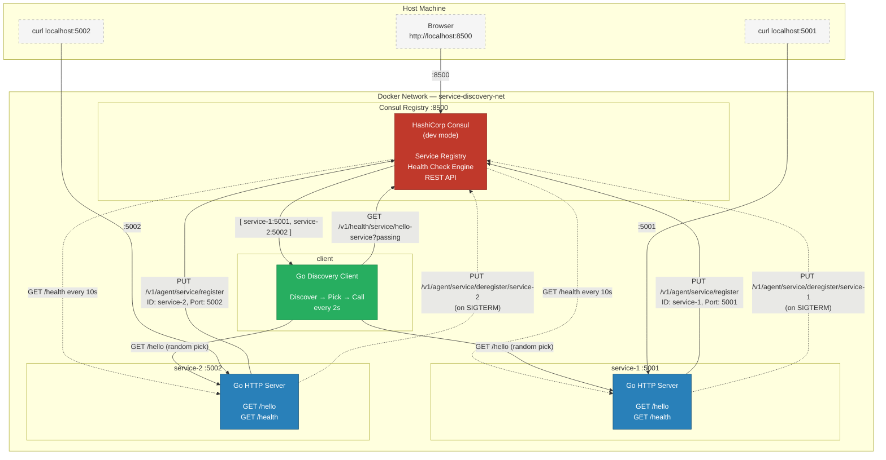
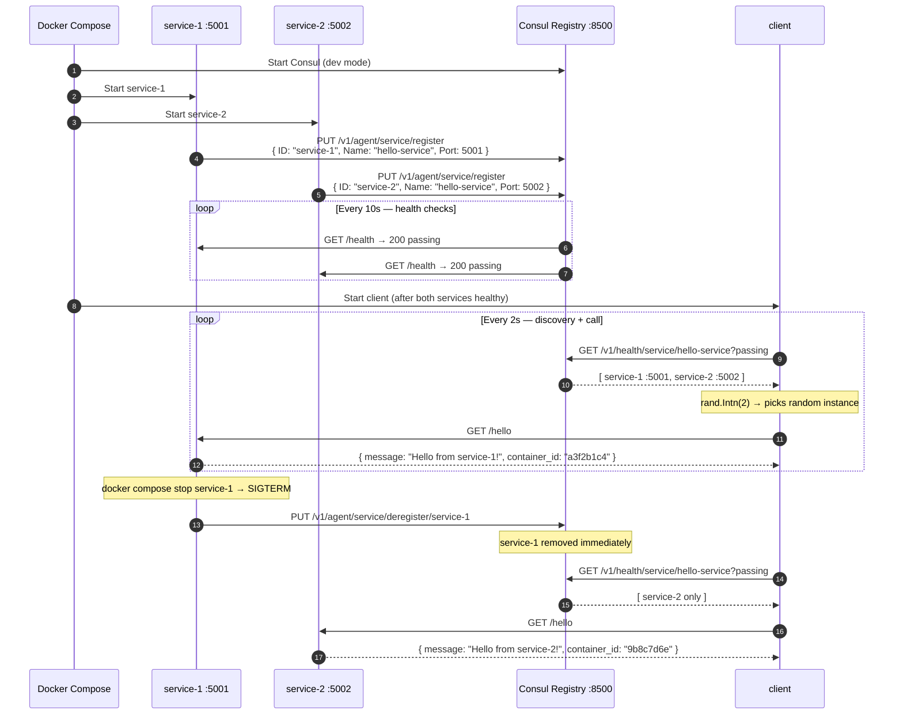

# Microservice with Service Discovery

CMPE-273 Week 7 — Service discovery using Consul, Go, and Docker Compose.

Demo Video - https://drive.google.com/file/d/14yuzUBBG7anziVkBMy30SoZjm6ly3H5B/view?usp=sharing

## Architecture

### Component Diagram



### Sequence Diagram



## How It Works

1. **Registration** — Each Go service calls `PUT /v1/agent/service/register` on Consul at startup. It registers with a unique `ID` (e.g. `service-1`), a shared logical `Name` (`hello-service`), its Docker DNS address, port, and a health check URL. Consul polls `/health` every 10 seconds to verify the instance is alive.

2. **Discovery** — The client calls `GET /v1/health/service/hello-service?passing`. The `?passing` parameter tells Consul to return only instances whose health check is currently passing — crashed or stopped instances are excluded automatically.

3. **Client-Side Load Balancing** — The client picks a random instance from the list using `rand.Intn` and calls `/hello` directly. No proxy or load balancer is involved. This is the simplest form of service discovery.

4. **Graceful Deregistration** — When a service receives `SIGTERM` (e.g. `docker compose stop`), it calls `PUT /v1/agent/service/deregister/<id>` before shutting down. Consul removes the instance immediately. The `DeregisterCriticalServiceAfter: 30s` config handles crash cases (SIGKILL) where graceful shutdown doesn't run.

## Stack

| Component | Technology |
|---|---|
| Service instances | Go (`net/http`) |
| Service registry | Consul 1.17 |
| Client | Go (`net/http`, `math/rand`) |
| Orchestration | Docker Compose |
| Container base | `golang:1.22-alpine` (build) + `alpine:3.19` (runtime) |

## Quick Start

```bash
git clone <repo-url>
cd week7
docker compose up --build
```

Wait ~20 seconds for all health checks to pass. The client logs will appear showing alternating calls to both instances.

Open the Consul UI at **http://localhost:8500**

## Demo Walkthrough

### Step 1 — Normal load balancing

```bash
docker compose logs -f client
```

Expected output (alternating between instances):
```
2024/03/18 10:00:02 [1] Discovered 2 instance(s). Picked: service-1 (service-1:5001)
2024/03/18 10:00:02 [CALL -> service-1]  message='Hello from service-1!'  container_id=a3f2b1c4
2024/03/18 10:00:04 [2] Discovered 2 instance(s). Picked: service-2 (service-2:5002)
2024/03/18 10:00:04 [CALL -> service-2]  message='Hello from service-2!'  container_id=9b8c7d6e
```

The `container_id` is the Docker container ID — proof that responses came from different physical containers.

### Step 2 — Dynamic failover (kill one instance)

In a second terminal:
```bash
docker compose stop service-1
```

Watch the client logs. Within 2 seconds, all calls route only to `service-2`:
```
2024/03/18 10:00:10 [5] Discovered 1 instance(s). Picked: service-2 (service-2:5002)
```

### Step 3 — Consul UI

Open **http://localhost:8500/ui** in your browser.

- Click **Services** → `hello-service` — shows registered instances and health status
- After stopping `service-1`, it disappears from the list immediately (graceful deregistration via SIGTERM)

### Step 4 — Query Consul API directly

```bash
curl -s "http://localhost:8500/v1/health/service/hello-service?passing" | python3 -m json.tool
```

This shows the raw JSON the client reads — makes the discovery mechanism fully transparent.

### Step 5 — Restore and verify recovery

```bash
docker compose start service-1
```

Wait ~15 seconds for the health check to pass. The client will return to routing calls to both instances.

### Step 6 — Call services directly from host

```bash
curl http://localhost:5001/hello
curl http://localhost:5002/hello
```

## Project Structure

```
week7/
├── docker-compose.yml      # Orchestrates consul + 2 service instances + client
├── README.md
├── service/
│   ├── main.go             # Go HTTP server: /hello, /health, Consul registration
│   ├── go.mod
│   └── Dockerfile          # Multi-stage build (golang:1.22-alpine → alpine:3.19)
└── client/
    ├── main.go             # Go client: discover, pick random, call /hello
    ├── go.mod
    └── Dockerfile          # Multi-stage build
```

## Environment Variables

### Service
| Variable | Default | Description |
|---|---|---|
| `INSTANCE_NAME` | `service-unknown` | Unique instance ID registered with Consul |
| `SERVICE_PORT` | `5000` | Port the HTTP server listens on |
| `CONSUL_HOST` | `consul` | Consul hostname |
| `CONSUL_PORT` | `8500` | Consul HTTP port |

### Client
| Variable | Default | Description |
|---|---|---|
| `CONSUL_HOST` | `consul` | Consul hostname |
| `CONSUL_PORT` | `8500` | Consul HTTP port |
| `POLL_INTERVAL` | `2` | Seconds between discovery + call iterations |
